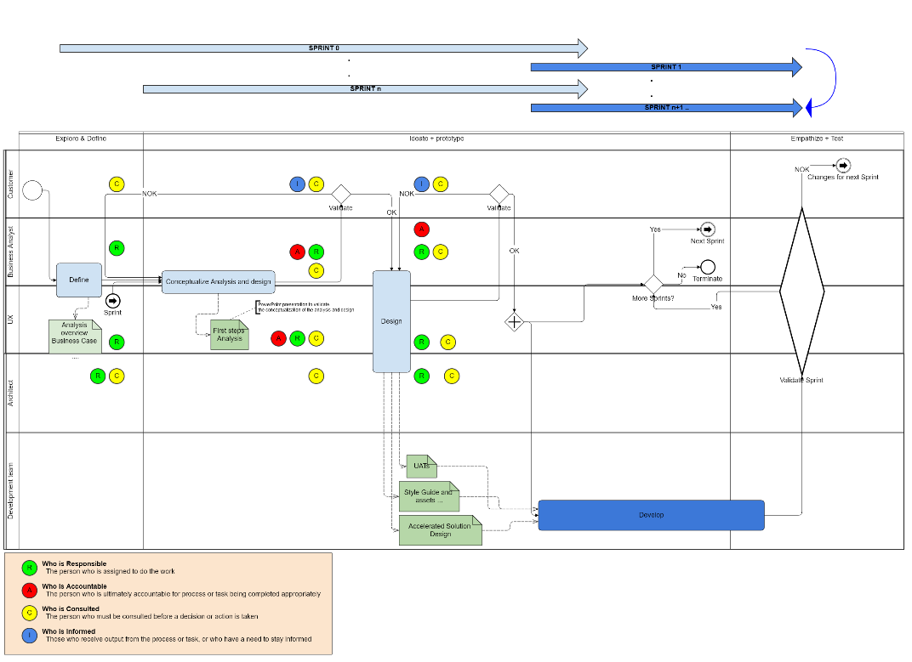

:toc: macro
toc::[]

[[accelerated-solution-design---ad-center--]]
= Accelerated Solution Design - AD Center -

[[purpose]]
= *Purpose*

The *purpose* of this Space is to *give a full overview of the set of activities, deliverables, tools and methods used at the AD Center to realize the Accelerated Solution Design (ASD) paradigm*.

The AD Center team shall customize those process, tools and methods for each project, depending on the type of project, its objectives, budget and planning, and the customer maturity.

The ASD is carefully designed to be a practical guideline that fosters and ensures the collaboration and communication among all team member. The members of the team involved in the ASD will be:

* Customer.
* Studio members, made up of UX Designer, Business Analyst and Architect
* Yard members, made up of Developers

Customers are key members of the team, as they understand the business and have needs and expectations, which the solution must fulfill. It is essential that customers get involved in the development from the beginning. Thus, the feeling of belonging the solution will be assured and the customer satisfaction will be improved. In addition to validating the solution and supporting all development phases.

Aiming for common understanding is crucial in this process and it is the main driver for ensuring that a *top quality solution* is provided. The best way to build shared understanding is by *validating* the assumptions. Hence, all the necessary stakeholders will be involved in the requirements elicitation, corresponding user story mapping and *prototype* creation.

The Accelerated Solution Design introduces a new type of *team*, which is broader, flexible and self-organized:

* The span of the team is *broader,* since *clients* are considered an important *part of the team*, a partner indeed. Customers shall have an active role in defining the user needs and validating the assumptions. In fact, they shall be consulted throughout the whole design and development processes. 
* The team shall be *flexible* enough to adapt to unexpected changes, such as new requirements or the introduction of more roles in the development of the solution. 
* Finally, each team member shall be *self-organized*. In other words, self-aware of their capacity and area of responsibility, able to organize their work and committed to ensure an efficient communication within the team.

 

image:extracted-media/mediaASD/image1.tmp[]

Summarizing, the Accelerated Solution Design is:

* A practical guideline rather than a “methodology”
* Based on industry standards rather than proprietary methods
* Consisting of an evolving, “living”, document set rather than a static, fixed document
* Encapsulating the business requirements, functional definitions as well as Architecture design
* Based on the intersection of Lean, Agile, DDD and User Story Mapping
* Based on the essential belief or paradigm that ASD should be
* Focused on the design (definition) of the “externally observable behavior of a system”
* Promoting comunication and collaboration between team members
* Guided by prototypes

[[key-principles]]
= *Key principles*

The core principles of the Accelerated Solution Design are the following:

* Involve end users in the development life cycle
* Learn and apply continuous improvement
* Visualize
* Be iterative
* Improve communication and collaboration among team members (Customer, Studio and Yard)

The practices adopted at the AD Center to apply those principles are:

* Intersection of a selection of industry standard practices
* Lean
* Agile requirements flow

Next, those three practices are explained.

[[intersection-of-industry-standard-practices]]
==  *1. Intersection of industry standard practices*

The ASD process will combine and apply the following industry standard practices:

* UX Design process through LEAN / Design Sprint (Google ventures)
* User Story mapping
* Domain Driven Design (DDD)

The final design (or rather “growing design”) emerges from the intersection of these three practices.

image:extracted-media/mediaASD/image2.tmp[] 

[[lean]]
== *2. Lean*

Using Lean discovery and design process model, the UX Designer, the Business Analyst and the Architect will work together to model and specify the design of the system and deliver to customer a product he desires much faster.

image:extracted-media/mediaASD/image3.tmp[]

[[agile-requirements-flow]]
== *3. Agile requirements flow*

The Business Analyst and UX Designer will follow the agile requirements flow below to perform the analysis of the required solution which shall fulfill the business needs.

image:extracted-media/mediaASD/image4.tmp[]

From the beginning, Business Analysts and UX Designers will work together with the Product Owner and users to understand the business needs.

Each business need will be documented as one or more Epic Story. Each Epic Story will be broken down into one or more appropriate user stories and required UX sketches and wireframing, which document the user interface and behavior of the solution.

The Business Analyst will discuss with the Project Owner and the Architect the modelling of the solution, using the User Stories as input for the discussion. At this point, the solution can be detailed with use cases, E-R, domain modelling, etc.

[[ways-of-working]]
= *Ways of Working*

This chapter describes in detail the process to be followed at the AD Center to deliver the solution.

Following points explain in detail each phase.

[[explore-and-define]]
== *Explore and Define*

To ensure the success of the project, the team must understand the needs of the customer, why they are necessary and what is the Minimum Viable Product (MVP) that the solution should deliver. 

At this stage of the development life cycle, it is necessary that the Business Analyst, UX Designer and Architect work together with project stakeholders to:

* Understand and examine the statement of purpose of the project, i.e. answer the WHY
* Collect the Business needs and objectives of the project. i.e. know the Minimum Viable Product to be delivered
* Define the Business requirements, i.e. determine WHAT must be provided by the solution
* Build the Glossary of Terms. It is important to define and clarify the vocabulary that is used by the customer and technical teams. This will avoid any misunderstanding in the future.

These are mainly analysis activities and are the starting point for Sprint 0, which is an Analysis and Design sprint.

*Tasks*

The main tasks of this phase are:

* _Define_. Understand and describe the customer needs.

*Inputs*

Some inputs to perform the above tasks are:

* Project charter.
* Meetings held with main stakeholders.

*Output*

The main outputs of this phase will be the following set of documents:

* Analysis Overview.

[[ideate-prototype]]
== *Ideate + prototype*

At this stage, the solution is designed and developed. To achieve that, each functionality, which are required to perform the required design and development sprints, will be prioritized.

As previously described, the AD Center will follow an agile requirement flow to analyze and design the solution (See link:#AcceleratedSolutionDesign-ADCenter--Agi[agile requirements flow]).

To do this, the following sprints are proposed:

* *Sprint 0* (Analysis & Design): Analysis and Design sprint that contains the requirements to be developed in the incoming development sprint. The duration of the sprint should not be more than two, three weeks and the expected output is the User Story mapping with the user stories to be developed.  +
The tasks involved in this sprint are:

* ** Conceptualize Analysis and Design
** Design

* *Sprint 1* (Development): The Development team will use the User Stories and related documentation prepared in the preceding Analysis & Design sprint to plan and execute the Development sprint.

Sprint 0 and 1 will be repeated until solution is completed and accepted by customer. The following iterations of Sprint 0 and 1 will be called n and n+1.

*Tasks*

The main tasks of this phase are:

* *Conceptualize analysis and design*.  The Business Analyst will work together with the UX Designer and customer to collect and document the requirements that fulfill the business needs. The requirements will be documented as epics and user stories, sketches and wirefraiming. In this task, the Business Analyst & UX Designer will generate a common document (First Steps Analysis) to present and validate the results of the tasks with the customer.
* *Design*. Once the First Steps Analysis document is validated by customer, the members of Studio will work together to make a solution design document (Accelerated Solution Design), which covers user needs that were identied in Ideate + Prototype phase. Additionally, the whole team will work together with customer to document the user acceptance tests (UATs) to be fulfilled by the solution. This UAT document should be finished before the development task starts, so that it can be used by the Development team to understand what is the expected behavior of the application. And finally, the Style Guide and Assets shall be documented as well. All these documents will be the main input material for the Develop task.
* *Develop*. The Development team will start its sprint with the details collected in the previous tasks.

*Inputs*

* Analysis Overview
* Meetings held with Customer.
* Meetings involving different members of the Development team (UX Designer, Business Analyst, Architect and Developers).

*Output*

* First Steps Analysis
* Accelerated Solution Design
* UATs
* Style guide, assets, … (UX docs.)

[[empathize-test]]
== *Empathize + Test*

This is the final stage of our model, but in an agile process, the results generated during the testing phase are used to redefine one or more problems and inform the understanding of the user, the conditions of use, how people think, behave, and feel, and to _empathize_.

In this phase, the development will be validated by using some techniques:

* Integration Tests. Tests that validates the interfaces with other systems. They can be automated using an external software.
* Functional Tests. Tests that validates the functionality of the system. They can be automated using an external software.
* Regression Tests. Tests that validates that existing functionality of the system works and was not broken by the new change. They can be automated using an external software.
* UATs. User acceptance tests, they are used for validating that the solution fulfills the requirements. They describe the minimum criteria the customer will use to accept the solution. They are usually executed by the customer.

*Tasks*

* Validate Development Sprint.
* Empathize and propose improvements for the next Ideate + prototype sprint.

*Inputs*

* UAT definition.
* Tests definitions.
* Meeting with customer, Business Analyst, UX Designer, Architect and development team.

*Output*

* UAT results
* Test status
* List of proposed changes

[[relationship-with-project-kick-off-phase]]
= *Relationship with project Kick-off phase*

Accelerated solution design defines how we must work at AD Center to develop the solution that support the project scope.

As first steps, BA’s, UX and architect work together with project stakeholders to identify and define:

* Business needs.
* High level requirements.
* Identify initial technical architecture that will support the requirements.
* Identify project dependencies, assumptions, constraints.
* Risks.

This information will be necessary at project kick-off phase to describe among other the following information:

* Project Scope and out of scope.
* Work packages and its planning.
* Required resources (as human as technical)
* Project risks.

*As we can see, there is a strong dependency between kick-off phase and the initial task of Accelerated Solution Design*. For this, kick-off phase will be the trigger the starting of ASD sprint zero and its *explore & define* step.  In this step, we will complete all required information of kick-off phase and when kick-off phase will be completed, Ad Center team should continue with the activities of Accelerated Solution Design. In parallel, project manager should supply the required resources, that were identifying at kick-off phase, to be able to continue with Accelerated Solution Design and the development of the solution.

[[deliverables-and-raci]]
= *Deliverables and RACI*

* *

[cols=",,,,,",options="header",]
|============================================================================================================
|* +
 * |*ROLES*
|*DELIVERABLE* |*CUSTOMER* |*BUSINESS ANALYST* |*UX DESIGNER* |*ARCHITECT* |*DEVELOPER TEAM*
|*Analysis overview* |Consulted |Responsible, Accountable |Responsible |Responsible,Consulted |
|*First steps Analysis* |Consulted, Informed |Responsible, Accountable |Responsible, Accountable |Consulted |
|*Accelerate Solution Design* |Consulted |Responsible, Accountable |Responsible |Responsible |Informed
|*UATs* |Consulted |Responsible, Accountable, |Consulted | |Informed
|*Style Guide, assets..* |Consulted | |Responsible, Accountable | |Informed
|============================================================================================================

[[analysis-overview]]
== *Analysis Overview*

This document shall provide the following information:

* Project introduction and Statement of purpose.
* Objectives of the purpose.
* Business requirements.
* Glossary of terms.
* Project Assumptions.
* Risk analysis.
* Dependencies.
* Constraints.
*   …

The following document show sample content of this document.

image:extracted-media/mediaASD/image6.tmp[]

[[first-steps-analysis]]
== *First Steps Analysis*

This document is used to present and validate the results of the analysis to and with customer.

The required content is:

* Actors that are involved in the process
* Details of the requirements that fulfill the business needs, in the form of Epics and User Stories
* Site map and sketches of the user interfaces that shall meet the requirements

 The powerpoint template can be found at following link:

 image:extracted-media/mediaASD/image7.tmp[]

[[accelerated-solution-design]]
== *Accelerated Solution Design*

This document, which is forwarded to Development team, describes in detail the expected behavior of the solution. It includes both functional and technical information.

The mandatory information described in this document is:

* Project introduction and statement of purpose.
* Objectives.
* User Story mapping. Epics and user story details.
* Site map and user interface design.
* Entity relationship diagrams.
* Bounded context.
* Glossary of terms.

It can optionally contain the following data:

* Class diagrams and anyother diagrams that help documenting the solution.

Click to access to https://confluence.s2-eu.capgemini.com/display/ACM/Jump+The+Queue+Project[Accelerate Solution Design] sample

[[uat]]
== *UAT*

It defines the user acceptance criteria the solution must fulfill.

A sample template can be found at following link:

file:///C:\download\attachments\4327289\UAT_Template_v1.xlsx%3fversion=4&modificationDate=1516092498094&api=v2[UAT_Template_v1.xlsx]

[[style-guides-assets-ux-docs.]]
== *Style guides, assets, … (UX docs.)*

This set of documents includes all UX designs (visual guides, types, colors, style guides, etc.) to be used by Developers to develop the solution.

 image:extracted-media/mediaASD/image8.tmp[]

[[design-process]]
= *Design Process*

The design Process is part of the Accelerated Solution Design.  However, due to the big extension of this section, it has been described as a separated section which can be consulted link:design_process.adoc[here].

[[architecture-process]]
= *Architecture Process*

[[overall-goals]]
== *Overall Goals*

The goal of the Accelerated Solution Design is to create a document that is:

*post-documentation*

The documentation was updated during and after the implementation: The implementation was governed by lean user stories created using the user story mapping method.

*Aligned to the implementation*

Structure, concepts and nomenclature should be close to the code.

*Allow for compact design documentation*

Much of the structuring of components and data should be presented at the Accelerated Solution Design deliverable and not need to be formally repeated in another documentation. The split of the application into components should be present in the code.

*Leanness*

The documentation should contain only the strictly needed information and should be very pragmatic.Easy to maintainIt should be versioned together with the code. A developer should be able to change it using only a text editor.

[[rationals]]
== *Rationals*

[[decisions-about-because-of-thisaccelerated-solution-design-deliverable]]
=== *Decisions about because of this accelerated solution design deliverable*

Accelerated solution design deliverable is not meant to be the basis of an implementation.

* It shall provide understanding of the system for maintenance and further development
* It shall refer to existing interface definitions wherever possible.

The level of detail of the doumentation is meant to provide understanding, but not all details of the system.

However, a certain level of detail was shown to be necessary for a thorugh understanding. Therefore, for example, the entities and their attributes are defined in the diagrams, but not in the tables below.

[[level-of-proximity-to-the-code]]
=== *Level of proximity to the code*

The idea behind this documentation is to:

*be close to the code*

The documentation should be stored together with the source code and should be versioned alongside the code.

*be modular*

The contents of the different documented components need to be edited seperately.

*be orientated at the structure of the business components*

The modules of the documentation shall not follow the package structure of the code, but the chapter structure of the documentation.

The definition of the business components shall be close to the code: Components in this documentation should be represented as components in the code. This however, cannot be done in each case, especially not in the case of the angular gui.

* The angular components are very technically oriented. Basing the specification on these components would not result in a comprehensive document. Therefore, the documentation differs at least in this regard from the implementation.

[[creation-of-a-ubiquitous-language-ddd]]
=== *Creation of a ubiquitous language (DDD)*

The main goal is to enhance the understanding between the business departments and the technical staff. The main way of doing this is be specifying a language that will be uniformly used from the specification to the interfaces, the implementation and the tests. This includes not only entities and attributes, but also component names, subsystem and system names etc.

One difference is the usage of prefixes for the terms: These are only used in the business specification and not in the implementation itself.

[[level-of-detail-of-the-documentation]]
=== *Level of detail of the documentation*

The level of detail differs depending on the customer and his requirements for the documentation of the implemented systems. However, a certain level of detail has proven to be useful for the business analysts who do not have regular access to the code:

* The attributes of entities should be present in the specification, both for interfaces and for database entities: The logic of the code often relies on these entities, and a specific reference to the required attributes is very beneficial for the precision of the documentation.
* The attributes do not need to be defined in the text: They may also be presented as an image.
* This image may also be technical, e.g. the export of a relational model in a database. Most readers can work with such diagrams, provided that some guidance is given for their interpretation. This is true both for database entities and for interface structures, e.g. for xml or json structures.
* …

[[specifics-of-the-specification-methodology]]
=== *Specifics of the specification methodology* 

The specification methodology is based on UML. It is based on the _Capgemini Specification Method_ and was tailored for the use as a post-documentation in agile projects. The usage of this method has led to a significant increase in in the quality and efficiency of the Capgemini software projects:

* Ramp-up times are reduced since the specification method is up and running in less time.
* The system specification can be completed quicker with fewer frictional losses.
* The quality of the system specification increases.
* The higher quality of the system specifications allows the depending disciplines design, implementation, test, etc. to be processed more quickly and efficiently and with higher quality.
* The Specification Method provides a structuring of the system that supports the project setup and handling in total.

The method is in detail described in the Specification Method manual.

[[selection-of-the-tools-and-the-storage]]
=== *Selection of the tools and the storage*

The main focus of the tooling was

* to enable each and every member of the development teams to create and update content of the specifications by using easy to use tools.
* to keep the file sizes small in order to be able to version it together with the code.
* to keep the specification modular and thereby to prevent huge monolithic files.
* to keep the necessary installation effort as low as possible
* to use only open source products.

Because of this, asciidoc was selected for the creation of the document and plantuml was selected for the diagrams.

[[tools]]
= *Tools*

[[confluence]]
== *Confluence*

Confluence is a team collaboration software. It is developed and marketed by Atlassian.

Confluence is a simple, powerful wiki that allows groups or departments to share information. A wiki is a website that lets people collaborate and share information quickly ("wiki" is a Hawaiian word for "fast).  It is organized into collaboration areas called spaces which contact pages, attachments, and other types of content that can be viewed and edited by users. 

The objective is that the deliveries will not a static document. It should be a dynamic document to which all team members have easy access.

*For this, confluence should be the repository where project documentation resides. Each documentation delivery will reside in confluence project space as pages to easily the maintenance, collaboration and access.*

[[jira]]
== *Jira*

Jira is a proprietary issue tracking product, developed by Atlassian. It provides bug tracking, issue tracking, and project management functions. The product name is a truncation of Gojira, the Japanese name for Godzilla, itself a reference to Jira's main competitor, Bugzilla

Jira will mainly be used for:

* Creating and managing Epics and User Stories.
* Managing project tasks and resources.
* Managing issues.

As confluence and Jira are developed by Atlassian, the tools have native integration. So, it is possible to share documentation between them.

 image:extracted-media/mediaASD/image9.tmp[]

[[enterprise-architect]]
== *Enterprise Architect*

Sparx Systems Enterprise Architect is a visual modeling and design tool based on the OMG UML. The platform supports: the design and construction of software systems; modeling business processes; and modeling industry based domains. It is used by businesses and organizations to not only model the architecture of their systems, but to process the implementation of these models across the full application development life-cycle.

image:extracted-media/mediaASD/image10.tmp[]

[[adobe-creative-cloud]]
== *Adobe Creative Cloud*

Adobe Creative Cloud is a set of applications and services from Adobe Systems that gives subscribers access to a collection of software used for graphic design, video editing, web development, photography, along with a set of mobile applications and some optional cloud services.

 image:extracted-media/mediaASD/image11.tmp[]

The design tools used in AD Center are *Axure RP8, Adobe XD, Adobe Photoshop* etc. Others desirable skills includes Graphic user interface (GUI), HTML, CSS, & JavaScript
