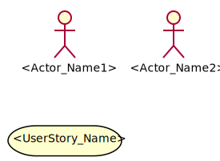
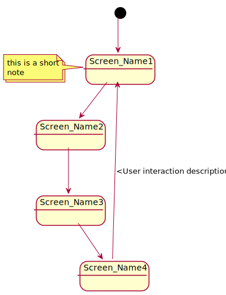
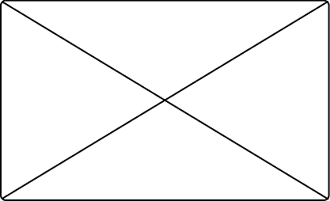
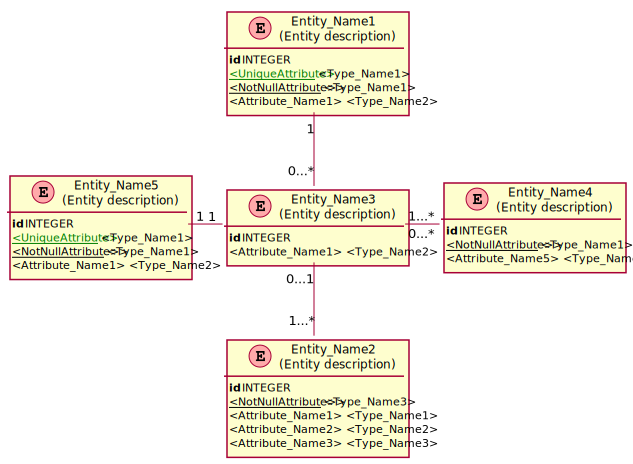
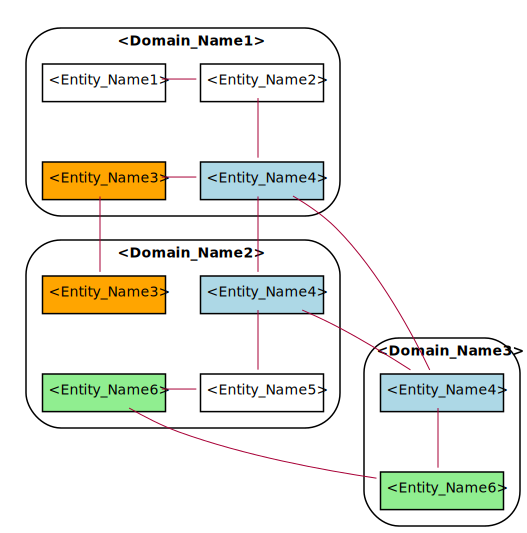
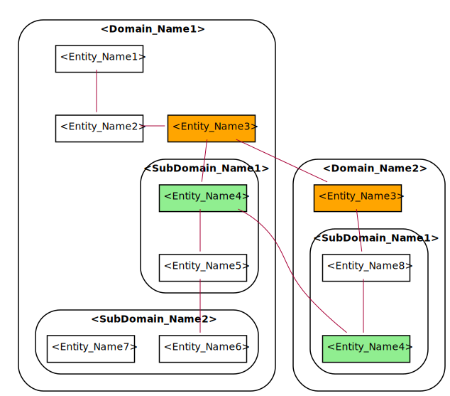

:toc: macro
toc::[]

NOTE: This document is used for giving a high-level system specification of your project. Try to use an
informal and natural language so that the reader easily understands the overview of your project.

[[project-name]]
= <Project_Name>

TIP: Content inside tags like <Project_Name> should be changed by your 
own project's informationt. additionally, delete all the tips before generating your document.

[[project-introduction.-statement-of-purpose]]
== *1. Project Introduction. Statement of Purpose*

_<The introduction should provide an overview of the application and of the important concepts used 
in these applications. This information should enable the reader to comprehend the different artifacts 
that are described after that>_

[[objectives]]
== *2. Objectives*

The objectives of this project are:

* _<State first objective>_
* _<State second objective>_
* _<State third objective>_

[[first-steps-analysis]]
== *3. First Steps Analysis*

_<Reference here any kind of visual presentation (like Power Point) that you have about your
 project. It should be used for presenting and validating the understanding of your User Stories 
 and the behaviour of the future solution to your customer. Template example link:https://github.com/devonfw/devon-methodology/blob/ASD_Practices/ADCenter_First_Steps_Analysis_Document_TEMPLATE.POTX[here]>_

[[user-stories]]
== *4. User Stories*

_<Give here a quick description of the main functionalities of your application. You may insert below a diagram explaining the flow of your project. Each functionality should be organized by the actor 
that handles it.>_

TIP: Remember that user stories are an informal, natural language description of one or more features 
of a software system, written from the perspective of an end user or user of a system.

The main actors that will interact with _<Project_Name>_ will be the following:

- _<Actor_Name1>_: _<Define here your actor>_

- _<Actor_Name2>_: _<Define here your actor>_

In the next points, we will see the details of the user stories that define the minimum functionality 
of _<Project_Name>_.

We can see the proposed user story map at the following figure:

_<Insert a user story map, with epics at the top and its use cases below, like the next example>_

image:extracted-media/mediaASDTemplate/UserStoryMap.svg[]

TIP: Remember that epics are a large body of work that can be broken down into a number of smaller stories.

[[epic-1.-epic-name1]]
=== *Epic 1. <Epic_Name1>*

_<Describe briefly this epic>_

As part of the process, this epic must implement:

_<List below the user stories that this epic must implement>_

. _<UserStory_Name1>_: _<Describe briefly this user story>_

. _<UserStory_Name2>_: _<Describe briefly this user story>_

. _<UserStory_Name3>_: _<Describe briefly this user story>_

The user stories that define this epic are:

_<Create a table for each user story that this epic contains>_

[[user-story-1.-user-story-1]]
==== User story 1. <UserStory_Name1>

[cols=",,,",options="header",]
|==================================================================================
|Story Narrative |_<UserStory_Name1>_ |Priority |_<From 1 to 10, being 10 highest priority>_
|As |_<Actors involved in this User Story>_ |Size | _<Effort measure for this User Story, from 1 to 10 being 10 highest effort. It should be stated by the architect.>_
|I need to |_<Goal of this User Story>_ |Dependency | _<If there is any dependency with other User Story, state here its number (US3)>_
|So that |_<Reason for this User Story>_ | |
|Acceptance Criteria a|
_<As with user stories it is hard to give a good description of the behaviour of this 
functionality, here you could define:>_

- _<Preconditions>_
- _<Postconditions>_
- _<Validations>_
- _<Scenarios>_
- _<Business rules>_
- _<Any kind of information that helps to describe its behaviour, like activaty diagrams.>_

 | |
|==================================================================================

[[user-story-2.-user-story-2]]
==== User story 2. <UserStory_Name2>

[cols=",,,",options="header",]
|==================================================================================
|Story Narrative |_<UserStory_Name2>_ |Priority |_<From 1 to 10, being 10 highest priority>_
|As |_<Actors involved in this User Story>_ |Size | _<Effort measure for this User Story, from 1 to 10 being 10 highest effort. It should be stated by the architect.>_
|I need to |_<Goal of this User Story>_ |Dependency | _<If there is any dependency with other User Story, state here its number (US3)>_
|So that |_<Reason for this User Story>_ | |
|Acceptance Criteria a|
_<As with user stories it is hard to give a good description of the behaviour of this 
functionality, here you could define:>_

- _<Preconditions>_
- _<Postconditions>_
- _<Validations>_
- _<Scenarios>_
- _<Business rules>_
- _<Any kind of information that helps to describe its behaviour, like activaty diagrams.>_

 | |
|==================================================================================

[[epic-2.-epic-name2]]
=== *Epic 2. <Epic_Name2>*

_<Describe briefly this epic>_

As part of the process, this epic must implement:

_<List below the user stories that this epic must implement>_

. _<UserStory_Name3>_: _<Describe briefly this user story>_

. _<UserStory_Name4>_: _<Describe briefly this user story>_

. _<UserStory_Name5>_: _<Describe briefly this user story>_

The user stories that define this epic are:

_<Create a table for each user story that this epic contains>_

[[user-story-3.-user-story-3]]
==== User story 3. <UserStory_Name3>

[cols=",,,",options="header",]
|==================================================================================
|Story Narrative |_<UserStory_Name3>_ |Priority |_<From 1 to 10, being 10 highest priority>_
|As |_<Actors involved in this User Story>_ |Size | _<Effort measure for this User Story, from 1 to 10 being 10 highest effort. It should be stated by the architect.>_
|I need to |_<Goal of this User Story>_ |Dependency | _<If there is any dependency with other User Story, state here its number (US3)>_
|So that |_<Reason for this User Story>_ | |
|Acceptance Criteria a|
_<As with user stories it is hard to give a good description of the behaviour of this 
functionality, here you could define:>_

- _<Preconditions>_
- _<Postconditions>_
- _<Validations>_
- _<Scenarios>_
- _<Business rules>_
- _<Any kind of information that helps to describe its behaviour, like activaty diagrams.>_

 | |
|==================================================================================

[[site-map]]
== *5. Site Map*

TIP: Remember that a sitemap is a list or diagram which represents the hierarchical structure
of the screens of your application.

We propose the following sitemap and screens structures to support the requirements that must fulfill the solution:

_<Insert below a list or diagram representing the hierarchical structure of the screens, 
like the next example: >_

_<List below all the screens shown on the diagram. Insert mockups if needed.>_

. _<Screen_Name1>_: _<Explain briefly this screen>_

. _<Screen_Name2>_: _<Explain briefly this screen>_

 - _<Insert mockup image of your screen>_

[[entity-relationship-diagram]]
== *6. Entity relationship diagram*

Starting from the list of user stories, we found the below entities to support them.

_<Insert below an entity diagram containing the entities that implement user stories.>_

Each entity will content the following information:

_<For each entity defined on your diagram, you will insert below a table with its information.>_

.1. <Entity_Name1>
_<Short description of this entity>_
[cols="",options="header",]
|======================================================================================
| Attribute| Type
|_<Attribute_Name1>_ | _<Type_Name1>_
|_<Attribute_Name2>_ | _<Type_Name1>_
|_<Attribute_Name3>_ | _<Type_Name2>_
|======================================================================================

.2. <Entity_Name2>
_<Short description of this entity>_
[cols="",options="header",]
|======================================================================================
| Attribute| Type
|_<Attribute_Name3>_ | _<Type_Name3>_
|_<Attribute_Name4>_ | _<Type_Name4>_
|_<Attribute_Name5>_ | _<Type_Name1>_
|======================================================================================

[[bounded-context]]
== *7. Bounded context*

TIP: Definition: a domain can be divided into sub-dormains such that they can be inserted 
inside a same context (bounded context). The bounded context is an area where certain sub-domains
make sense. The boundaries of the different bounded contexts are the connection points where sub-domains
from different contexts are connected.

In this point, we will define the bounded context of the final solution.

In the figure below we have _<Number of domains>_ domains.

NOTE: Normally, domains are related to epics such that they may contain one or multiple epics.

_<List below all the domains and subdomains that your project contains.>_

* *_<Domain_Name1>_*: _<Explain briefly this domain>_. The related entities are:

** _<List here the entities that are related to this domain:>_

** _<Entity_Name1>_: _<If this entity is shared by multiple domains, specify them here>_
** _<Entity_Name2>_: _<If this entity is shared by multiple domains, specify them here>_
** _<Entity_Name3>_: _<If this entity is shared by multiple domains, specify them here>_

* *_<Domain_Name2>_*: _<Explain briefly this domain>_. The related entities are:

** _<List here the entities that are related to this epic:>_

** _<Entity_Name4>_: _<If this entity is shared by multiple domains, specify them here>_
** _<Entity_Name5>_: _<If this entity is shared by multiple domains, specify them here>_
** *_<SubDomain_Name1>_*: _<Explain briefly this sub-domain>_. The related entities are:
*** _<Entity_Name6>_: _<If this entity is shared by multiple domains, specify them here>_
*** _<Entity_Name7>_: _<If this entity is shared by multiple domains, specify them here>_

_<Insert below a diagram of the bounded context you have just explained. Each domain will contain the
entities you have declared above. Entities that are shared between epics should have the same colour>_

_<The next figure is an example of domains containing sub-domains>_

[[glossary-of-terms]]
== *8. Glossary of terms*

_<In this section you will define those terms that are not clear enough and need to be explained.
 Insert a table like shown below:>_

[cols=",",options="header",]
|===========================================================================================================================================================
|Term |Description
|_<Term_Name1>_ | _<Define this term>_
|_<Term_Name2>_ | _<Define this term>_
|_<Term_Name3>_ | _<Define this term>_
|===========================================================================================================================================================
