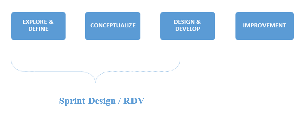

[[design-process]]
= Design Process

[[purpose-1]]
== Purpose

The purpose of this Document is to give a full overview of activities, deliverables, methods and tools per phase. Adaption for every project is needed depending on the type of project, objective, budget, planning, and customer maturity.

[[key-principles-1]]
== Key principles

The key principles to consider in every phase of a project is:

* Involve end users
* Learn
* Visualize
* Be iterative
* Collaborate with client

[[main-steps-1]]
== Main Steps

The main steps in the way of working skeleton are:

* Explore & Define
* Conceptualize
** Ideate
** Create
** Iterate
** Validate
* Design & Development
* Continuous Improvement

[[alignment-with-gv-google-ventures-design-sprint-method-rdv-rapid-design-visualization-1]]
== Alignment with GV (Google Ventures) Design Sprint Method | RDV (Rapid Design Visualization)

Since the GV Design Sprint Method is an important method we need to align this method with our UX approach. 
The way we see it is that we (can/will) use the GV Design Sprint Method during the concept phase to focus on specific design challenges, especially for coming to a first prototype (What needs to be in a MVP). 

It can be helpful because it shows stakeholders what it means to design applications, and second you have a complete prototype in a short amount of time that we can continuously expand. But also during further development new conceptualization is needed and design sprints can be used for this (or will it be research sprints to test the prototype). 

The first two steps of the UX approach and the Design Sprint Method have almost the same phases. They follow the principles of Research, Ideate, Create, Iterate and Validate.
The same explanation can be applied to the RDV or Rapid Design Visualization method. It also follows the principles of requirements compilation along with the business team, end users and developers, and then the Ideate, Iterate, Create, and Innovate wheel till we get a validated and complete design ready to deliver to development. 

The main difference in here is that, RDV approach usually uses the development team to create a working prototype into which the changes of the iterations are applied. With the help of the UX team, this prototype is quickly made with prototyping design tools such as Axure, Sketch, etc… making the changes in a minimum amount of time and without the need of complex coding and presentations. This also considerably reduces the overall development time.

[[alignment-with-the-full-scale-project-1]]
== Alignment with the full scale project

The UX process appears all over the timeline of a full scale project, but has stronger presence in the early phases. 
Most of the times an assignment will not cover the entire design process, but only a part of it, therefore each step in this way has an end deliverable. This way we can offer the phases as building blocks, so that the client can decide what he wants us to do. We'll represent here a full coverage example, Lean based.

image:extracted-media/mediaDesign/image1.png[]

[[how-we-do-the-steps-to-follow-1]]
== How we do | the steps to follow

First of all, we need a couple of days to prepare all the material, templates and presentations we need to set the basis of our work. They can be physical assets like stationery, templates, continuous paper, etc. or online docs like PDF, Word and PowerPoint templates or videos. Adaption for every project is needed depending on the type of project, objective, budget, planning, and customer maturity. 
It's also important to create the multidisciplinary team who is going to work in the process, setting an initial schedule and a due date if we know it.

This way of working works well remotely with the use of skype meetings and agile documents interchange in the main touch points of the process, but we strongly recommend that the first two steps being as face-to-face as possible, to get a complete immersion into the project and to achieve an optimal communication, often disrupted for things such as the language, bad connections and lack of visual acknowledgment. 

image:extracted-media/mediaDesign/image4.png[]

[[explore-define-1]]
===  *1) Explore & Define*

image:extracted-media/mediaDesign/image5.png[]

*End result*

The end result of this phase is a clear definition of the problem and a framework for the solution. 

*Preferred Tools* 

PowerPoint, Word, Google slides, Google docs. 

*Team* 

The Project Manager, Solution Delivery Office, Client and User.

*Global Documents*

*High Level Analysis* _(it can be a document or a group of documents)_

[[kick-off-meeting-1]]
==== 1.1) Kick Off Meeting

*Input*: Initial requirements shared by the client, if any. +
*Process*: The initial meeting with the client, where input/requirement gathering happens. +
The UX designer and Business Analyst have to ask questions (about specifications/preferences) to the client to get the maximum feedback from the client. The minutes of the meeting will be documented. +
*Output*: *Debrief, Technical Capabilities* *&* *Requirements Document*. The word document of the contents discussed in the meeting which includes the requirements from client side and their preferences and specifications.

*Team Shared Deliverables*: Requirements Document

image:extracted-media/mediaDesign/image6.png[]

[[research-1]]
==== 1.2) Research

*Input*: Debrief, Technical Capabilities, User KPI, User interviews, shadowing, ethnographic analysis and objectives. 

*Process*: Before we start designing a digital service, like an app, a website or an intranet, we need to understand the customer, his needs, his behavior and his environment. For this we will need to interview and observe them, but also use existing insights, like design trends, analytics and available research. 

We also need to know the client's business. We need to know their business goals (KPI's), the business value they want to achieve and the current situation concerning technical and organizational capabilities (mapped to the needs of the customer). 

*Output*: *Business Model Canvas, Benchmarking &* *Review* *Report*. Understanding and documenting the current market trends and user expectations.

*Team Shared Deliverables*: Review Report

image:extracted-media/mediaDesign/image7.png[]

[[analysis-1]]
==== 1.3) Analysis

*Input*: Review Report & Requirements Document. 

*Process*: Analyze the input obtained from kick off meeting, research and team review, and find out how this product can give a competitive edge among the competitors in terms of user experience and what are the UX parts involved in this requirement to execute this project. Estimation of the UX process is also done in this stage. 

It's important to have a clear and uniform view on the challenges we need to solve (both of the customer and of the business). Visualizing these insights in persona's, customer journeys, experience maps and maybe even infographics of the business and technology side will help with this. 

Analysis stage includes creating personas, customer journeys maps, etc. In this stage, the UX team should do a thorough research on the current market for the product, user behavior and user expectations about the product. 

The Persona is the representation of type of end user, who can belong to the customer organization or come from external user groups. The user research can be done by conducting online surveys, user interviews within or outside the organization; the market research can be done using online reviews and social media.

With the information obtained in these three phases, we will complete the High Level Analysis document together with the Business Analyst.

*Output: Personas, Customer Journey, Stakeholder Map, ­High Level Roadmap, Estimation & Analysis Report*

*Team Shared Deliverables*: Estimation & Analysis Report

image:extracted-media/mediaDesign/image8.png[]

[[conceptualize-1]]
=== 2) Conceptualize

image:extracted-media/mediaDesign/image9.png[]+

*End result* 

The end result of this phase is a validated concept with brand/visual design vision, content strategy, interaction design guidelines and a proven technical solution to accelerate development. These deliverables help with the progress of designing the digital service. 

*Description* 

The main reason to have a concept phase separate from the detailed design is that it fits the type of project in which the client only wants to have a design, but we do not develop it. 

*Preferred Tools* 

Axure, Adobe XD, Illustrator, Photoshop, Sketch, Invision, POP, HTML5, CSS. 

*Team* 

Solution Delivery Office, client and user.

[[ideate-1]]
==== 2.1) Ideate

In this step we´ll start conceptualizing and drafting the solution. First, we need to get inspired to come up with ideas that are innovative and let customers be amazed (sparkle). We design the optimal flow for the customer within an app and/or web site that meets their needs and exceeds their expectations. 

Besides involving end users and clients in every phase, it's important that we do this together with the client. The process itself should also be a good experience to them, so that they enjoy working together with us to create the best digital part of their service.

image:extracted-media/mediaDesign/image10.png[]

[[brain-storming-1]]
===== 2.1.1) Brain Storming

*Input*: The final High Level Analysis. 

*Process*: After the project requirements are finalized, the UX team should have a brainstorming session, which is a deep thought process, where they will find the solution for 'how to convert the user requirements to a design'. In this stage, the UX designer will come up with set of solutions for converting/visualizing the project requirements to design interfaces for user interaction. 

*Output*: The set of ideas which helps to transform the requirements into a design.

image:extracted-media/mediaDesign/image11.png[]

[[create-1]]
==== 2.2) Create

When the best idea has been chosen, the sketching starts together with business, technology and customers. Together we can translate an idea to a high-level concept on Interaction, Branding and Content, which everybody agrees on. 

*Output*: Concept description, sketches, card sorting (task work flows and information architecture).

image:extracted-media/mediaDesign/image12.png[]

[[sketching-1]]
===== 2.2.1) Sketching

*Process*: In this stage, the initial sketching of the design is done. The output can be traced using a pencil and paper or using some rough sketching tools. The UX designers can work on different design styles to give multiple options. 

*Output*: Initial sketching of the interface.

image:extracted-media/mediaDesign/image13.png[]

[[card-sorting-defining-an-information-architecture-1]]
===== 2.2.2) Card Sorting: Defining an Information Architecture

*Process*: In a card sorting session, participants organize topics into categories that make sense to them and they may also help you label these groups. To conduct a card sort, you can use actual cards or pieces of paper. The purpose of Information Architecture is to structure, label, and organize the content. The UX designer has to do the story boarding/documenting the solutions obtained from brainstorming session. Through the information architecture, a UX designer finds out not only how each piece of the site fits together, but also how each item relates to all the other items within this structure. 

*Output*: The hierarchy, information architecture, structure of each element of the interface for the user to interact.

image:extracted-media/mediaDesign/image14.png[]

[[task-work-flow-1]]
===== 2.2.3) Task Work Flow

*Process*:Task analysis identifies the actions and cognitive processes required for a user to complete a task or achieve a particular goal. In this stage, the tasks the user can perform on this interface and the tasks the system can perform should be identified. 

*Output*: Task analysis report.

image:extracted-media/mediaDesign/image15.png[]

[[iterate-1]]
==== 2.3) Iterate

When the concept is clear we will create low fidelity wireframes and prototypes to visualize the requirements. This way there are no differences in interpretation possible and all stakeholders can agree on the same, this early in the process. Conceptualizing and designing has an iterative character in which we create, validate and improve. 

*Output*: Wireframes, prototype, information architecture and design principles.

[[wireframing-1]]
===== 2.3.1) Wireframing

*Input*: The sketching used as the reference 

*Process*: The wireframing is the elaborated/detailed sketching of the design, it enables to deeper enter into the UX process and define in detail the user journeys before delivering the visual design part. The design also depends on the platform, so consideration needs to be made for different devices, operating systems, cultural behavioral differences (if it's a global job). Mockup tools like Axure RP, iRise, Sketch or Adobe XD can be used to create wireframes. Several iterations can happen on this stage. 

*Output*: Detailed wireframes of different pages.

image:extracted-media/mediaDesign/image16.png[]

[[prototyping-1]]
===== 2.3.2) Prototyping

*Input*: Wireframes, final requirement document and task work flow are the inputs 

*Process*: The final version is detailed enough to start the detailing and development phase. Not everything will be described in a prototype but the most important flows, screens and the elements on the screen are defined, interaction and visual design. The details of each element are not final and will be defined in next phase, besides the rest of the screens and all alternative flows. This prototype is validated by customer. 

*Output*: Low fidelity Wireframes, customer validated low fidelity prototype and high level information architecture.

image:extracted-media/mediaDesign/image17.png[]

[[validate-1]]
==== 2.4) Validate

Prototyping also enables us to test the app or website with end- users in an early stage. It's important to involve customers (end users) to know as soon as possible if the concept is going to work. 

*Output*: User testing results.

[[user-testing-1]]
===== 2.4.1) User Testing

*Input*: Customer validated low fidelity prototype of the product. 

*Process*: User testing / Usability testing refers to evaluating a product or service by testing it with real users. Users are asked to complete tasks, typically while they are being observed by a researcher, to see where they encounter problems and experience confusion. Usability testing lets the design and development teams identify problems before they are coded. The earlier issues are identified and fixed, the less expensive the fixes will be in terms of both staff time and possible impact to the schedule. 

*Output*: User/Usability testing results and solutions for fixing the problems found.

image:extracted-media/mediaDesign/image18.png[]

[[design-and-develop-1]]
=== 3) Design and Develop

image:extracted-media/mediaDesign/image19.png[]

*End result* 

The end result of this phase is the digital service itself. This can be in different variants. It can be an improved version of the existing channel, a Beta version or a Minimum Viable Product to start with. 

*Preferred Tools* 

Axure, Adobe XD, Illustrator, Photoshop, Sketch, Invision, POP, Sublime, HTML5, CSS. 

*Team* 

UX Designer(s), Development team, client and user.

[[craft-1]]
==== 3.1) Craft

We combined the detailed design with the development, because all that you develop needs to be considered in the design. 
Business involvement (customer meeting) is important at this stage as well, because the devil is in the details and a lot of questions and decisions will be made during detailing the design. Working closely together with business and development in this stage, is needed to offer the best digital service to the customer. 

*Craft Output*: High fidelity wireframes and Analytics implementation plan.

image:extracted-media/mediaDesign/image20.png[]

[[visual-design-1]]
===== 3.1.1) Visual Design

*Input*: Final wireframes and prototypes, design principles. 

*Process*: In this stage designers convert the wireframes to actual design. The specifications and branding guidelines from client has to be followed when creating visual design. This is the final design of the product and which will give an idea about how the final product will actually look like. Tools like Photoshop, Sketch or Adobe XD can be used to create visual design. 

*Output*: Final, detailed and Hi fi Visual design and (if clients wants) microinteractions.

image:extracted-media/mediaDesign/image21.png[]

[[ui-testing-1]]
===== 3.1.2) UI Testing

*Input*: The final visual design screens. 

*Process*: After creating the visual design, a user interface testing has to be performed. The design validation has to be done to check whether the design guidelines and specifications are followed properly and ensure the consistency and uniformity of the design of different pages. 

*Output*: UI testing results of the visual design has to be documented. Changes or recommendations has to be noted and implemented as applicable.

image:extracted-media/mediaDesign/image22.png[]

[[build-1]]
==== 3.2) Build

When we know the concept works, we will start designing the details with a multidisciplinary team, preferably in an agile process. 

*Build Output*: MVP, HTML/CSS Layout, Mock ups, Style Guides, Visual assets and Content.

[[create-assets-1]]
===== 3.2.1) Create Assets

*Input*: The final visual design screens. 

*Process*: In this step designers create the assets required for development. It includes cropping of images and creating icons with proper specifications. Designers has to create design instructions for the developers to develop the page in line with the visual design. 

*Output*: The assets required for development (cropped images, icons, design instructions etc.)

image:extracted-media/mediaDesign/image23.png[]

[[style-guides-1]]
===== 3.2.2) Style Guides

*Input*: The final visual design screens, branding guidelines and front-end documentation. 

*Process*: UI/UX designers need to deliver specs about each component of the project (buttons, menu, colors, typography etc.). They will explain animations, grid structures, interactions and component states, so that the developers can deliver the right outcome as efficiently as possible. 

*Output*: Style guide with design specifications, guidelines and CSS description. 

image:extracted-media/mediaDesign/image24.png[]

[[front-end-develop-1]]
===== 3.2.3) Front-End Develop

*Input*: The final visual design screens, technical framework solutions and style guides. 

*Process*: Front-end system integration to develop the user interface with the latest technologies. Working with HTML, CSS and JavaScript, also we use frameworks to speed up development construction. 

*Output*: HTML/CSS Layout, themes and templates development.

image:extracted-media/mediaDesign/image25.png[]

[[continuous-improvement-1]]
=== 4) Continuous Improvement

image:extracted-media/mediaDesign/image26.png[]

*End result* 

The end result of this phase is an optimized version of the digital service based on data continuously. 

*Preferred Tools* 

Tobii (In progress), Skype, Quick Time, Google analytics, Google survey, Survey monkey, Google slides, Google form. 

*Description* 

After go live we're not there yet. Actually, it's just the beginning. Now we can learn and make changes to optimize the services we offer within the app, website or internal application to our customer. 

Involving the customer in this optimization cycle, helps to build a relationship with that customer. We show that they are important to us, that we listen and we value their feedback. 

*Output* 

Analytics Dashboard (PPT, One slide all KPI's), recommendation report, etc. 

*Team* 

The project Manager, UX Designer(s), Business Analyst, Development Team, client and user.

[[testing-1]]
==== 4.1) Testing

Complete testing can help address issues and help the team to improvement the application. +
*Output:* A/B testing, remote testing, user feedback, surveys, analytics dashboard.

[[follow-up-development-1]]
==== 4.2) Follow Up Development

Monitor the project throughout the development stage and give instructions and support to the developers. 

*Output:* Design bugs report.

image:extracted-media/mediaDesign/image27.png[]

[[ui-fixeschanges-1]]
==== 4.3) UI Fixes/Changes

There are possibilities of UI bugs when implementing the design in development process, UI/UX designer should find out the issues and fix it.

image:extracted-media/mediaDesign/image28.png[]

[[manage-change-request-1]]
==== 4.4) Manage Change Request

When a change request comes from client, the UX designer has to follow the design steps to implement the new changes without affecting the development process. Mockups and style guides has to be updated accordingly.

image:extracted-media/mediaDesign/image29.png[]

[[recommendations-1]]
==== 4.5) Recommendations

As part of continuous improvement, the UX designers are free to suggest or recommend positive changes in design/workflow if it gives improved user experience. 

*Output:* Recommendations and opportunities document.