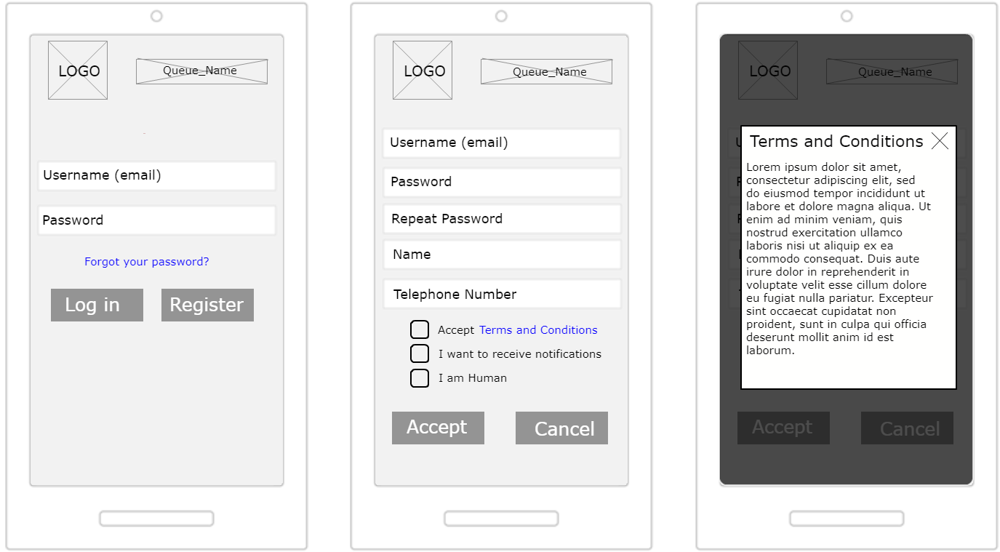
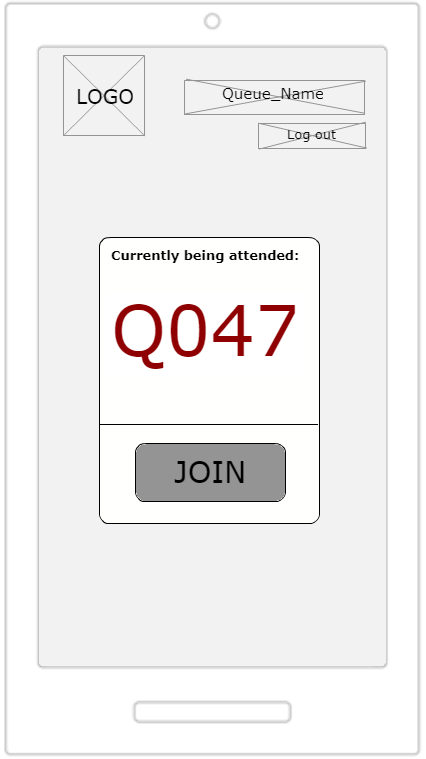
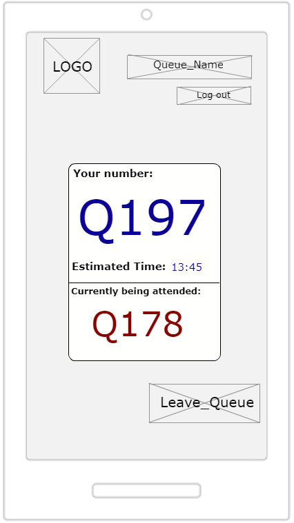
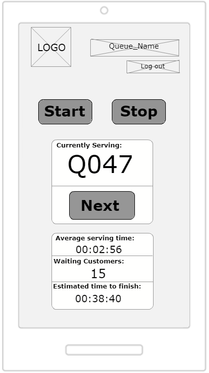
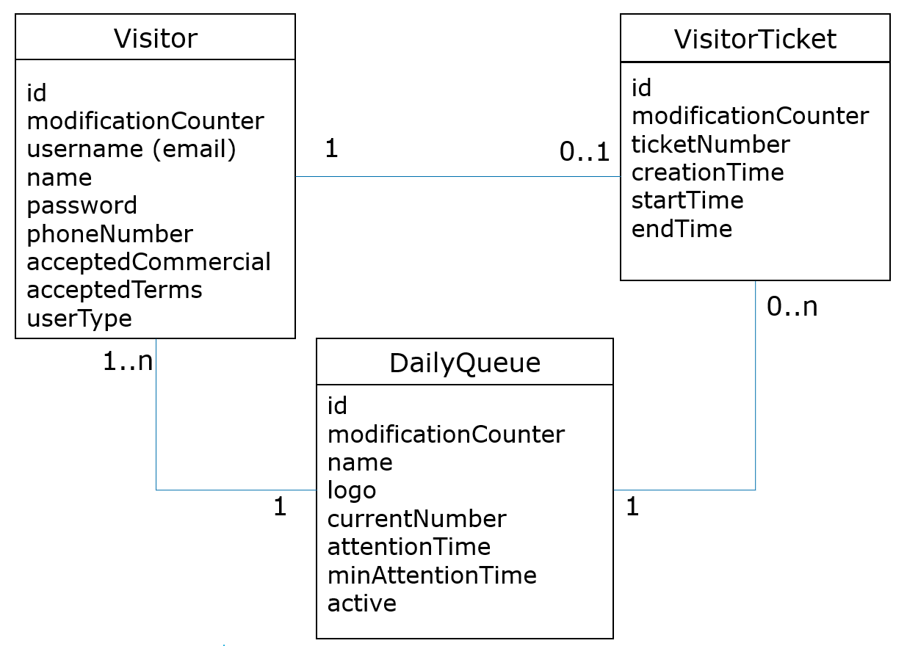

:toc: macro
toc::[]

[[jump-the-queue-project]]
= Jump The Queue Project

[[project-introduction.-statement-of-purpose]]
== *1. Project Introduction. Statement of Purpose*

Customers value their time as much as business owners do, and existing ticket dispensers do not help caring about them. Currently, customers need to physically go to the establishment, take a number and wait for a while. Not only is this system inefficient, as customers have to book an unreasonable amount of time only to get to the shop assistant, but also a sales barrier, as many customers get discouraged and walk away, or do not even visit the shop.

Capgemini proposes an outstanding application to manage your queue. This service will contribute to a relaxed visit through your shop by prescribing customers when to approach your desk. 

This application helps you improve the customer satisfaction as it eliminates the need to stand waiting, reduces the actual and perceived wait time and improves your business image.

Capgemini only delivers user-centric and scalable applications which are easy to use and solve your problems at the same time.

[[objectives]]
== *2. Objectives*

The objectives of the project are:

* Reduce the actual and perceived waiting time.
* Improve the user experience by easing the access to the queue.
* Simplicity and scalability.

[[first-steps-analysis]]
== *3. First Steps Analysis*

This is the link:///171124_ADCenter_JTQ_First_Steps_Analysis_Document_V1_4.pptx[First Steps Analysis] presentation used to present and validate our understanding of the User Stories and behaviour of the future solution with customer.

[[user-stories]]
== *4. User Stories*

The first objective of Jump the Queue is to improve the time management of the user, providing the needed functionalities to do so.

The solution focuses on this premise and has to facilitate the process of accessing and consulting the queue.

Roughly, the entire process that a user will follow to obtain and consult the access code of a queue will be:

image:media/pProcessMap.png[]

The main actors that will interact with jump the queue component will be the following:

-      Visitor: User of the queue component that requests access to the queue.

-      Owner: User that manages the queue.

In the next points, we can see the details of the user stories that define the minimum functionality of Jump the Queue component.

We can see the proposed user story map at the following figure.

image:media/pUserStoryMap.png[]

[[epic-1.-register-and-log-in]]
=== *Epic 1. Register and Log in*

This epic contains all needed functions that allow users to Log in if they have an account and Register if they dont.

To perform this step, Jump the queue must support the following:

1º Access Log In screen.

2º Filling out of personal data.

3º Verification of human identity (No robot).

The user stories that define this epic are:

[[user-story-1.-accept-terms-conditions]]
==== User story 1. Accept terms & conditions

[cols=",,",]
|==================================================================================
|As |Visitor & Owner  |
|I need to |access the login screen |
|So that |I can access the service provided by the shop| 
|Acceptance Criteria a|
-The user can choose to register or log in.

-The user can enter his or her username and password.

-The username must be an email.

-If the user requests to log in, the system checks if the user has entered a valid username and password.

-If the user has requested to log in and the username or password are missing or are not valid, the system informs the user.

-The user can request a password reminder email be sent to his or her registered email account.

 | 
|==================================================================================

[[user-story-2.-registration]]
==== User story 2. Registration

[cols=",",options="header",]
|================================================================================
|As |visitor 
|I want to |fill in the registration form 
|So that |I can get registered in the queue system
|Acceptance Criteria a|
-The user can enter the following mandatory information:

  -Username, which must be a valid email account
  
  -Password
  
  -Name
  
  -Telephone
  
-By default the commercial notifications must be deactivated. 

-The user can refuse to receive commercial notifications.

-The user can accept the terms and conditions.

-The user can click the “No robot” captcha.

-Once the terms & conditions are accepted and the “No robot” captcha is checked, the “Accept” button is enabled.

|================================================================================

[[user-story-3.-read-terms-&-conditions]]
==== User story 3. Read Terms & Conditions

[cols=",",options="header",]
|==================================================================================
|As |visitor  
|I need to |to read the terms and conditions of the queue  
|So that |I can complete my registration 
|Acceptance Criteria a|
- The user can read the terms and conditions statement of the queue.

|==================================================================================

[[user-story-4.-log-out]]
==== User story 4. Log out

[cols=",",options="header",]
|======================================================================================================
|As |visitor  
|I need to |log out of the system 
|So that |I can log in as another user
|Acceptance Criteria a|
-At any moment, the logged in users can log out of the queue system (“Logout” button) and their ticket number must persist in the system.

-Upon logout request, the user is sent to the login screen.

 
|======================================================================================================

[[user-story-5.-priority-access]]
==== User story 5. Priority access

[cols=",,,",options="header",]
|======================================================================================================
|Story Narrative |Priority access |Priority |5
|As |VIP user  |Size |
|I want to |get priority access code to the queue  |Dependency |
|So that |I will be served earlier | |
|Acceptance Criteria a|

- The access code will be formatted as an "A" plus a number between 0 and 999, which will be the next free number, e.g. A001.

- The numbering starts at value 0. If the number has reached 999, the numbering continues with 0.

 | |
|======================================================================================================

[[epic-2.-consult-the-queue]]
=== *Epic 2. Consult the queue*

This step contains all functions to consult the status of the user in the queue.

Jump the queue must support the following:

- Show people their position in the queue
- Show the estimated time to be attended

The user stories that define this epic are:

[[user-story-6.-consult-queue]]
==== User story 6. Consult Queue

[cols=",,,",options="header",]
|===============================================================================================================================================================================
|Story Narrative |Consult queue |Priority |10
|As |visitor or VIP user or owner |Size |
|I want to |consult the status of the queue |Dependency |
|So that |I can know who is being served, when I am expected to be served and how I will be called | |
|Acceptance Criteria a|
- The visitor and VIP users have to provide the identificator generated for this queue and the email or telephone number used to register in that queue.

- The system will respond showing the access code of the user, the name, the estimated time and the list of unattended access codes for this queue.

- The list of unattended access codes will be arranged in chronological order, placing first the priority access codes (Axxx) and then the rest of access codes (Qxxx).

- The users registered for the queue can consult the status of the queue at any moment.

- The owner of the queue can see the access code of the current turn.

 | |
|===============================================================================================================================================================================

[[user-story-7.-waiting-time]]
==== User story 7. Waiting time

[cols=",,,",options="header",]
|==================================================================================================================================================================================================================
|Story Narrative |Waiting time |Priority |10
|As |visitor or internal user |Size |
|I want to |see my estimated waiting time |Dependency |
|So that |I would know when I will be attended | |
|Acceptance Criteria a|
- The system has to calculate the estimated time with the following formula: current hour + (Sum(The last ten attention time)/nº of attended turn counted)*(number of non-attended turns in the queue before this).

- The number cannot be less than a configurable value.

- The attention time is the difference between the start time and the end time.

 | |
|==================================================================================================================================================================================================================

[[epic-3.-manage-queue]]
=== *Epic 3. Manage queue*

It contains all functions that allow to manage the queue in order to configure and attend active turn.

The user stories that define this are:

[[user-story-8.-configure-queue]]
==== User story 8. Configure queue

[cols=",,,",options="header",]
|=============================================================================
|Story Narrative |Configure queue |Priority |5
|As |jump the queue owner of the queue |Size |
|I want to |personalize the logo and description showed to users |Dependency |
|So that |I can personalize my business | |
|Acceptance Criteria a|
- The system allows to configure a logo and description.

- Jump the queue front shows the logo and description

 | |
|=============================================================================

[[user-story-9.-attend-queue]]
==== User story 9. Attend queue

[cols=",,,",options="header",]
|================================================================
|Story Narrative |Attend queue |Priority |10
|As |jump the queue owner of the queue |Size |
|I need to |know the current turn of the queue |Dependency |
|So that |I can attend it | |
|Acceptance Criteria a|
* The turn has to be the first in the queue that is non-attended.

* The system must save:

** At the previous turn: Save the current time as end time

** At the new turn: Save the current time as start time

 | |
|================================================================

[[site-map]]
== *5. Site Map*

We proposed the following sitemap and screen structures to support the requirements that must be fulfilled according to the solution.

image:media/SiteMap.PNG[]

1º Log In or Register. This is the first step where a user has to either Log In to an existing account or register a new one where he/she would also have to accept the terms and coditons and prove he/she is human.

2º Home Screen. Here you can see the current status of the queue and either log out or join the queue.

3º Queue Screen. This is where you can see your number in the queue, the estimated time at which you'll be attended, which number is currently being attended and leave the queue.

Finally, we have the queue management screen where the queue owner can start and stop the queue as well as pass the turn and consult general information such as how many people are still waiting, how long it takes them to attend each visitor and how long it would still take at the current rate to finish the entire queue

[[entity-relationship-diagram]]
== *6. Entity relationship diagram*

Starting from the list of user stories, we created the below entities to support them.

Each entity will contain the following information:

.1. Visitor
It contains the personal information of the visitors who gave the permission to use it.
[cols="",options="header",]
|======================================================================================
| Attribute| Type
|id | BigInt
|modificationCounter | Int
|username(email) | EmailType
|Name | String
|password | String
|phoneNumber | TelephoneType
|acceptedCommercial| Boolean
|acceptedTerms| Boolean
|userType| String
|======================================================================================

.2 VisitorTicket
It contains all the necesary information about the Ticket of ech visitor
[cols="",options="header",]
|================================================================================
| Attribute| Type
|id | BigInt
|modificationCounter | Int
|ticketNumber | String
|creationTime | TimeStamp
|startTime | TimeStamp
|endTime | TimeStamp
|================================================================================

.3 DailyQueue
It contains all the information about the daily queue.
[cols="",options="header",]
|================================================================================
| Attribute| Type
|id | BigInt
|modificationCounter | Int
|name |String
|logo |ImageType
|currentNumber |String
|attentionTime| TimeType
|minAttentionTime| TimeType
|active| Boolean
|================================================================================

[[bounded-context]]
== *7. Bounded context*

In this point, we will define the bounded context of the final solution.

In the figure below we have three domains, one for each related Epic.

* Obtain Access code domain: As we saw at epic chapter, this domain contains the required logic to get a turn in the queue. The related entities are:

** Access code: It is shared with Consult queue status domain.
** Queue: It is shared by the three domains.
** Personal information
** Terms and conditions: This is shared with Manage queue domain.

* Consult queue status domain: It has the needed logic to check turn status. This is supported by the entities:

** Access Code: It is shared with Obtain access code domain.
** Queue: It is shared by the three domains.

* Manage queue domain: This domain contains all functionalities to configurate the queues and their owners.

** Queue: It is shared by the three domains.
** Terms and conditions: This is shared with Manage queue domain.
** Queue owner.

image:media/BoundedContext.png[]

[[glossary-of-terms]]
== *8. Glossary of terms*

[cols=",",options="header",]
|===========================================================================================================================================================
|Term |Description
|Access code |This is the turn number assigned to a person.
|Validation code |It is a code used to confirm the validity of the email or telephone number informed by the user
|Estimated time |Stands for the time that the system calculates when the person in the queue will be attended
|Attention time |This is the time that it takes for a user to be attended. It is calculated as the difference between the start and the end of the attention
|Priority access |It is the access granted to privileged users so they can be attended earlier
|===========================================================================================================================================================

image:http://i.creativecommons.org/l/by-nd/4.0/88x31.png[]

This documentation is licensed under the link:http://creativecommons.org/licenses/by-nd/4.0/[Creative Commons License (Attribution-NoDerivatives 4.0 International)]
