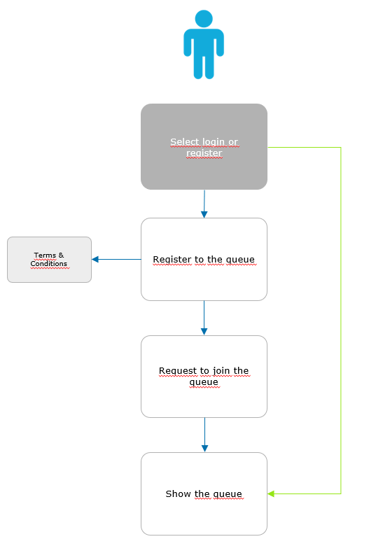
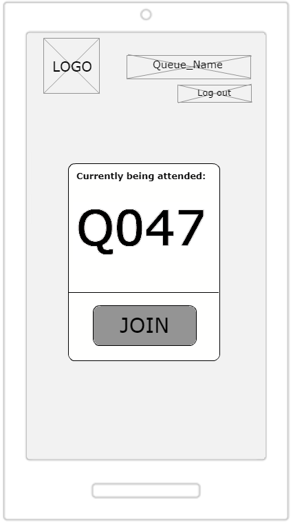
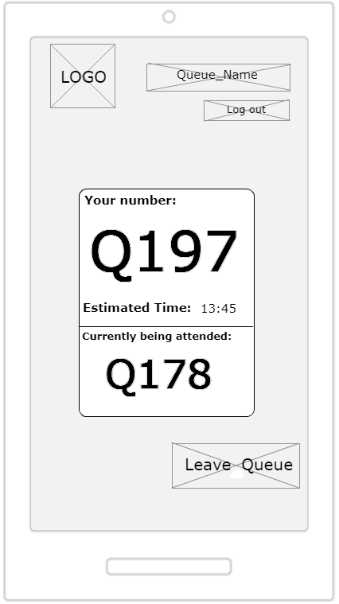
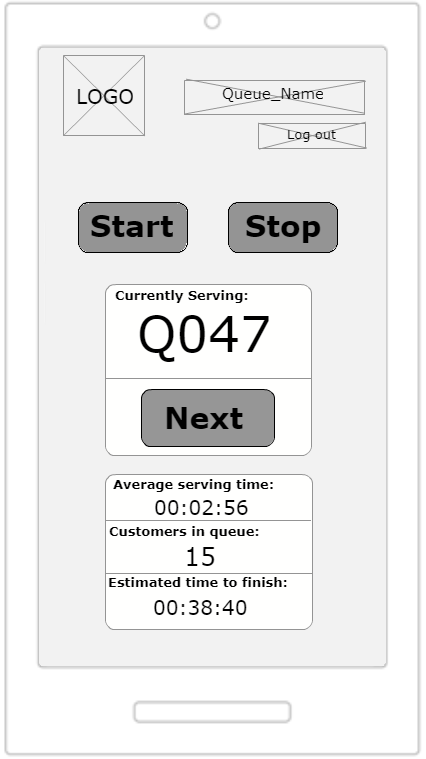

:toc: macro
toc::[]

[[jump-the-queue-project]]
= Jump The Queue Project

[[project-introduction.-statement-of-purpose]]
== *1. Project Introduction. Statement of Purpose*

Customers value their time as much as business owners do, and existing ticket dispensers do not help caring about them. Currently, customers need to physically go to the establishment, take a number and wait for a while. Not only is this system inefficient, as customers have to book an unreasonable amount of time only to get to the shop assistant, but also a sales barrier, as many customers get discouraged and walk away, or do not even visit the shop.

Capgemini proposes an outstanding application to manage your queue. This service will contribute to a relaxed visit through your shop by prescribing customers when to approach your desk. 

This application helps you improve the customer satisfaction as it eliminates the need to stand waiting, reduces the actual and perceived wait time and improves your business image.

Capgemini only delivers user-centric and scalable applications which are easy to use and solve your problems at the same time.

[[objectives]]
== *2. Objectives*

The objectives of the project are:

* Reduce the actual and perceived waiting time.
* Improve the user experience by easing the access to the queue.
* Simplicity and scalability.

[[first-steps-analysis]]
== *3. First Steps Analysis*

This is the link:///ADCenter_JumpTheQueue_First_Steps_Analysis_V0.3.pptx[First Steps Analysis] presentation used to present and validate our understanding of the User Stories and behaviour of the future solution with customer.

[[user-stories]]
== *4. User Stories*

The first objective of Jump the Queue is to improve the time management of the user, providing the needed functionalities to do so.

The solution focuses on this premise and has to facilitate the process of accessing and consulting the queue.

Roughly, the entire process that a user will follow to obtain and consult the access code of a queue will be:

image:media/pProcessMap.png[]

The main actors that will interact with jump the queue component will be the following:

-      Visitor: User of the queue component that requests access to the queue.

-      Owner: User that manages the queue.

In the next points, we can see the details of the user stories that define the minimum functionality of Jump the Queue component.

We can see the proposed user story map at the following figure.

[[epic-1.-register-and-log-in]]
=== *Epic 1. Register and Log in*

This epic contains all needed functions that allow users to Log in if they have an account and Register if they dont.

To perform this step, Jump the queue must support the following:

1º Access Log In screen.

2º Filling out of personal data.

3º Verification of human identity (No robot).

The user stories that define this epic are:

[[user-story-1.-accept-terms-conditions]]
==== User story 1. Accept terms & conditions

[cols=",",]
|==================================================================================
|As |Visitor & Owner  
|I need to |access the login screen 
|So that |I can access the service provided by the shop 
|Acceptance Criteria a|
- The user can choose to register or log in.
- The user can enter his or her username and password.
- The username must be an email.
- If the user requests to log in, the system checks if the user has entered a valid username and password.
- If the user has requested to log in and the username or password are missing or are not valid, the system informs the user.
- The user can request a password reminder email be sent to his or her registered email account.

|==================================================================================

[[user-story-2.-registration]]
==== User story 2. Registration

[cols=",",]
|================================================================================
|As |visitor 
|I want to |fill in the registration form 
|So that |I can get registered in the queue system
|Acceptance Criteria a|
- The user can enter the following mandatory information:
** Username, which must be a valid email account  
** Password
** Name
** Telephone
- By default the commercial notifications must be deactivated. 
- The user can refuse to receive commercial notifications.
- The user can accept the terms and conditions.
- The user can click the “No robot” captcha.
- Once the terms & conditions are accepted and the “No robot” captcha is checked, the “Accept” button is enabled.

|================================================================================

[[user-story-3.-read-terms-and-conditions]]
==== User story 3. Read Terms & Conditions

[cols=",",]
|==================================================================================
|As |visitor  
|I need to |to read the terms and conditions of the queue  
|So that |I can complete my registration 
|Acceptance Criteria a|
- The user can read the terms and conditions statement of the queue.

|==================================================================================

[[user-story-4.-log-out]]
==== User story 4. Log out

[cols=",",]
|======================================================================================================
|As |visitor  
|I need to |log out of the system 
|So that |I can log in as another user
|Acceptance Criteria a|
- At any moment, the logged in users can log out of the queue system (“Logout” button) and their ticket number must persist in the system.
- Upon logout request, the user is sent to the login screen.

|======================================================================================================

[[epic-2.-join-and-consult-the-queue]]
=== *Epic 2. Join and Consult the queue*

This step contains all functions to join the queue and consult the status of the user in the queue.

Jump the queue must support the following:

- Show customers their position in the queue
- Show the estimated waiting time to be served

The user stories that define this epic are:

[[user-story-5.-home-screen]]
==== User story 5. Home Screen.

[cols=",",]
|===============================================================================================================================================================================
|As |visitor 
|I want to |see the home screen of the queue
|So that |I can decide to join it
|Acceptance Criteria a|
- The user can see the current ticket number being served in the queue.
- The user can request to join the queue (“Join” button).
- The user can request to go back to the login screen (“Logout” button).

|===============================================================================================================================================================================

[[user-story-6.-join-request]]
==== User story 6. Join request.

[cols=",",]
|==================================================================================================================================================================================================================
|As |visitor
|I want to |to join the queue
|So that |I can be served by the shop assistant
|Acceptance Criteria a|
- Upon request to join, if the queue is:
Stopped, the user gets a message reporting that.
Started, the user gets the first available ticket number and the estimated time to be attended.
- The format of the ticket number is: Qxxx (e.g. Q047). When the value Q999 is reached, the numbering restarts at Q000. 
- If a ticket number was removed from the system, it cannot be re-assigned unless it had been the last number assigned.
- Each user can have only one ticket number at a time.
- The user can see:
** The assigned ticket number
** Waiting time
** The current ticket number being served
- The user can cancel the request to join and go back to the login screen. The assigned ticket number will be removed.

|==================================================================================================================================================================================================================

[[user-story-7.-calculate-waiting-time]]
==== User story 7. Calculate the waiting time.

[cols=",",]
|====================================================================================================================================================================================================================
|As |visitor
|I want to |see the estimated wating time
|So that |I  can know when I am expected to be served
|Acceptance Criteria a|
- The waiting_time is calculated as: (Sum of last X attention_times / X) * (nº of non-attended customers in queue before me).
- The attention_time is calculated as: the period between the moment the customer starts to be served and the moment the next customer is called.
- If the end time of a visitor is not set, it is not used to calculate the attention time.
- The waiting_time cannot be shorter than a configured minimum waiting_time. If that happens, the waiting_time is set to that configured minimum waiting_time.

|====================================================================================================================================================================================================================

[[user-story-8.-queue-status]]
==== User story 8. Queue status.

[cols=",",]
|=======================================================================================
|As |visitor
|I want to |see the status of the queue
|So that |I know when I am expected to be served
|Acceptance Criteria a|
- The users can consult the status of the queue at any moment even if the user has closed the session or logged out.
- If the user has a ticket number that was not called yet and logs in, the user will see:
** his or her ticket number
** the waiting time to be served (recalculated) 
** the current ticket number being served.
- The user can quit from the queue (“Leave Queue” operation) at any moment.
- Upon cancellation of the user request to join the queue, the user gets back to the home screen and the ticket number that was assigned to this user is removed from the system.
- The user can request to go back to the login screen (“Logout” button).

|=======================================================================================

[[epic-3.-operate-queue]]
=== *Epic 3. Operate the queue*

It contains all functions that allow management of the queue in order to configure and serve the active turn.

The user stories that define this are:

[[user-story-9.-call-next]]
==== User story 9. Call next customer.

[cols=",",]
|=============================================================================
|As |Owner
|I need to |to close the current customer service
|So that |I can call next customer
|Acceptance Criteria|
* The owner can see the ticket number of current customer.
* The owner can call next customer (“Next” button), which will be the first in the queue that is non-attended.
* Upon a call for a new customer:
** The service end time for current customer (if any) gets updated with current time.
** The service start time for the new customer (if any) gets updated with current time.
** The displayed ticket number is updated to the ticket number of the new customer (if any). If there are no new customers, no ticket number is displayed.
** The attention time is updated.
|=============================================================================

[[user-story-10.-start-queue]]
==== User story 10. Start the queue

[cols=",",]
|================================================================
|As |Owner
|I need to |start the queue
|So that |my customers can join the queue
|Acceptance Criteria|
* The owner can start the queue by pressing the “Start” button.
* The system will ask the customer to confirm that he or she wants to start the queue.
* Upon a queue start confirmation, the numbering of the queue is reset to Q000.

|================================================================

[[user-story-11.-stop-queue]]
==== User story 11. Stop the queue

[cols=",",]
|================================================================
|As |Owner
|I need to |stop the queue
|So that |my customers cannot join the queue
|Acceptance Criteria|
* The owner of the queue can stop the queue by pressing the “Stop” button.
* The system will ask the customer to confirm that he or she wants to stop the queue.
* The system stops the process that grants new ticket numbers to the customers that request to join the queue.
* At midnight a cronjob clears the unattended ticket numbers and, if still running, stops the process that generates new ticket numbers.

|================================================================

[[site-map]]
== *5. Site Map*

We proposed the following sitemap and screen structures to support the requirements that must be fulfilled according to the solution.

1º Log In or Register. This is the first step where a user has to either Log In to an existing account or register a new one where he/she would also have to accept the terms and coditons and prove he/she is human.

image:media/LoginRegister.PNG[]

2º Home Screen. Here you can see the current status of the queue and either log out or join the queue.

3º Queue Screen. This is where you can see your number in the queue, the estimated time at which you'll be attended, which number is currently being attended and leave the queue.

Finally, we have the queue management screen where the queue owner can start and stop the queue as well as pass the turn and consult general information such as how many people are still waiting, how long it takes them to attend each visitor and how long it would still take at the current rate to finish the entire queue

[[entity-relationship-diagram]]
== *6. Entity relationship diagram*

Starting from the list of user stories, we created the below entities to support them.

image:media/ER.png[]

Each entity will contain the following information:

.1. Visitor
It contains the personal information of the visitors who gave the permission to use it.
[cols="",options="header",]
|======================================================================================
| Attribute| Type
|id | BigInt
|modificationCounter | Int
|username(email) | EmailType
|Name | String
|password | String
|phoneNumber | TelephoneType
|acceptedCommercial| Boolean
|acceptedTerms| Boolean
|userType| String
|======================================================================================

.2 VisitorTicket
It contains all the necesary information about the Ticket of ech visitor
[cols="",options="header",]
|================================================================================
| Attribute| Type
|id | BigInt
|modificationCounter | Int
|ticketNumber | String
|creationTime | TimeStamp
|startTime | TimeStamp
|endTime | TimeStamp
|================================================================================

.3 DailyQueue
It contains all the information about the daily queue.
[cols="",options="header",]
|================================================================================
| Attribute| Type
|id | BigInt
|modificationCounter | Int
|name |String
|logo |ImageType
|currentNumber |String
|attentionTime| TimeType
|minAttentionTime| TimeType
|active| Boolean
|================================================================================

[[bounded-context]]
== *7. Bounded context   [Outdated]*

In this point, we will define the bounded context of the final solution.

In the figure below we have three domains, one for each related Epic.

* Obtain Access code domain: As we saw at epic chapter, this domain contains the required logic to get a turn in the queue. The related entities are:

** Access code: It is shared with Consult queue status domain.
** Queue: It is shared by the three domains.
** Personal information
** Terms and conditions: This is shared with Manage queue domain.

* Consult queue status domain: It has the needed logic to check turn status. This is supported by the entities:

** Access Code: It is shared with Obtain access code domain.
** Queue: It is shared by the three domains.

* Manage queue domain: This domain contains all functionalities to configurate the queues and their owners.

** Queue: It is shared by the three domains.
** Terms and conditions: This is shared with Manage queue domain.
** Queue owner.

image:media/BoundedContext.png[]

[[glossary-of-terms]]
== *8. Glossary of terms*

[cols=",",options="header",]
|===========================================================================================================================================================
|Term |Description
|Access code |This is the turn number assigned to a person.
|Estimated time |Stands for the time that the system calculates when the person in the queue will be attended
|Serving time |This is the time that it takes for a user to be attended. It is calculated as the difference between the start and the end of the attention
|===========================================================================================================================================================

image:http://i.creativecommons.org/l/by-nd/4.0/88x31.png[]

This documentation is licensed under the link:http://creativecommons.org/licenses/by-nd/4.0/[Creative Commons License (Attribution-NoDerivatives 4.0 International)]
