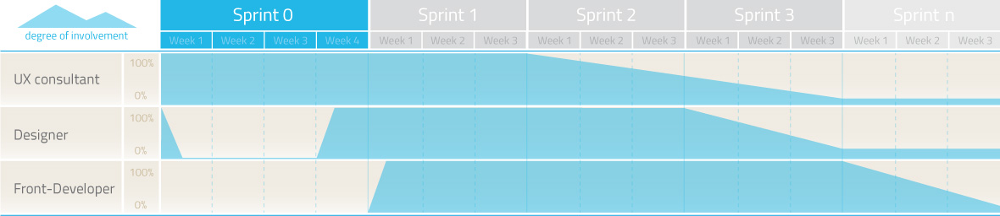
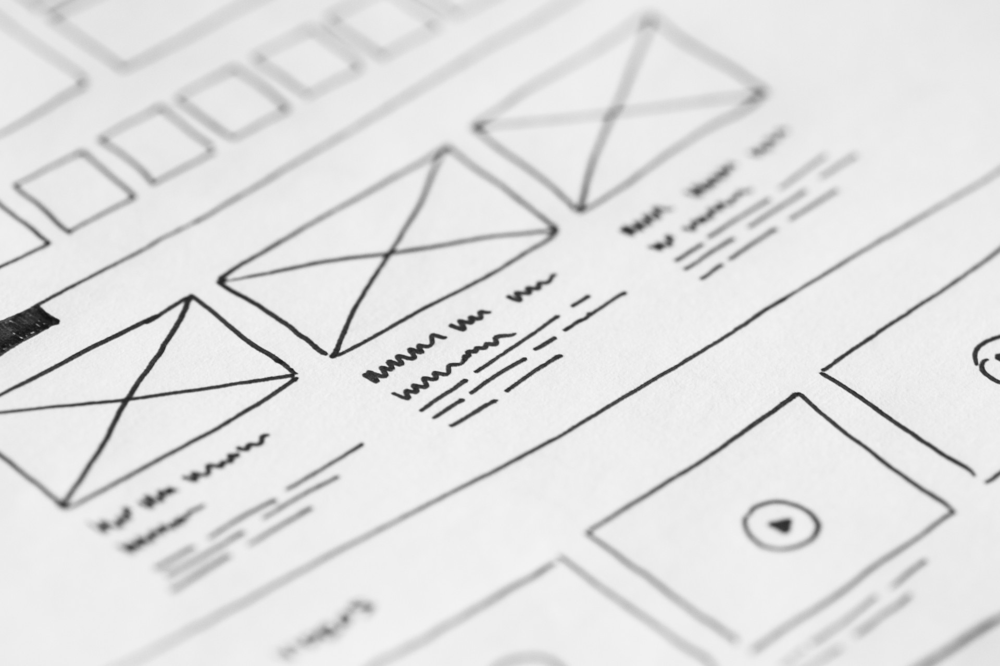

# UI/UX Methodology

## Introduction

This document gathers the methodology that UI/UX teams have implemented with success in many engagements. This methodology tries to define a strategy that other teams can incorporate in their projects to improve estimations and project planning in general. 

With this strategy the UX Team integrates itself in a process of Agile development together with the Dev Team. This allows to focus on the requirements and the Dev Team needs in order to improve the speed of the deliverables.

In addition to this, a **Design Process** is proposed at the very beginning of the methodology. This proposal is based on [Google Design Sprint Process](http://www.gv.com/sprint/). 

## UI/UX Team Process

The way the UX team currently integrates itself in the agile development process is using a concept sprint prior to it. This sprint is called **Sprint 0** and lasts from 2 to 4 weeks depending on the project size. In those weeks the UX team will made a preliminary design sprint and work on the following points: making of the requirements or research, data architecture, navigation flows, designing the low fidelity wireframes for the whole project and the high fidelity wireframes corresponding to the next sprint.

In the following sprints the deliverables of the previous ones will be reviewed and updated if it is necessary and the prototypes for the next sprint will be prepared. 

The following graph shows the involvement of each team in a common project across time according to the above information. 

**Sprint 0:**
- [Design sprint](#design_process) (explained below).
  - Making of the requirements.
  - Information architecture.
  - Navigation flows.
- Style guide definition. 
- Low fidelity wireframes for the whole application.
- High fidelity wireframes that correspond to the user cases scheduled for the next sprint.

**Sprint 1:**
- Review and update sprint 0 deliverables.
- Prepare high fidelity prototypes for sprint 1.

**Sprint 2:**
- Review and update sprint 1 deliverables.
- Prepare high fidelity prototypes for sprint 2.

**Sprint 3...** Same process here.

## Design Process 

We define a **design sprint** of five phases **at the beginning of the sprint 0**. Each phase takes approximately 1 day to perform (8 hours) and all 5 phases take approximately 40 hours to execute in full:

This process should be iterative. Revisions are recommended based on the last sprint and then re-iterate the last two phases (at a minimum). However, if you find your idea is not gaining the traction that you expected; you can also move further back and re-iterate from there.

### Unpack

Representatives from all relevant functions and at all levels within the organization such as sponsors, senior managers, marketers, designers, developers, customer service, sales, user support, etc. will be got together to ensure that all of them are aiming in the same direction.

Everyone will *unpack* all the knowledge of the problem within the team. It can be helpful to use an external facilitator for these meetings: they can then ask the questions necessary to help people focus and ensure that understanding is complete without anyone in the team having to lose face to do so.

The following points may be included in the unpack event:

- A presentation by the senior management representative outlining why the opportunity presented is important to the business.
- Competitive Reviews.
- Demonstrations of the problem and any bits of the solution that may already be available.
- A detailed walkthrough of the proposed solution.
- User personas.
- Analytical data available.
- The metrics of success (these should be useful business metrics and not metrics pulled out of the air).

It is important to involve the whole team in the unpack event. Do not let an individual or group dominate proceedings. The idea is to ensure everyone is on the same page and you can only ensure this if everyone is heard from.

### Sketch
Sketch is an individual effort that could be done in **one day**. Everyone is tasked with coming up with a detailed solution to the problem. 

It’s best to do this on paper for two reasons:

- It’s quick and if things need changing it takes no time to do.
- Not everyone is going to be a master of whatever wire-framing tools you use.

For particularly complex or large-scale problem solving; you may want to break up the problem into *manageable chunks* and assign people a chunk rather than the whole problem.

The aim of sketch day is to get as many ideas down as possible. If your team is huge and you’re going to generate a ton of ideas – you might want to allocate an hour at the end of the day to quickly reduce the number of ideas to a more manageable number before you go into the third day of the spring.  

### Decide

Decide Day is all about making a decision as to which idea (or ideas) are going to be taken to the prototype phase. However, there’s more to Decide Day than making a decision – it’s really about working out how the solutions may conflict with current objectives, abilities, resources, users, etc.

The day can be started by quickly listing any assumptions that things are made such as:

- Budget
- Users
- Technology Capacity
- Business Drives

Then it is time to review each idea and look at the conflicts that it generates (and creating ideas to overcome conflicts).

We should have an objective in mind during the review. We should be looking to constantly refine our list and remove ideas that simply are not feasible early in the process.

Once we have the idea or ideas we will prototype – the last part of Decide Day is to create some storyboards for the ideas. These should define each interaction with a user in a step-by-step process. This will be the specification for our prototype. We may also want define a user story or two (a la Agile Scrums) to help beef up the specification.

The **UX will also want to recruit participants**, for the final day’s testing, on Decide Day.

### Prototype

This is where the work gets serious. We have a single day to create a prototype that our users can test on the final day.

It is recommended that Keynote or Powerpoint and the available templates on [Keynotopia](http://keynotopia.com/) be used to rapidly build interactive prototypes. But we can use any tool of our choice. Just pick the one that we master enough for rapid prototyping.

In tandem, the research team should be finalizing the testing schedules and developing the interview script for that schedule.

### Test

As we all know, user experience requires user involvement. On the last day of our sprint we are going to bring up to 20 users (and no less than 6) together and work with the one-on-one as they play with the prototype.

Everyone involved in a test should make notes and record what they feel they’ve learned. We want to take these notes and summarize them at the end of the day. This should help us decide what needs iterating and improving.

## Final words

Though this is a tried and tested methodology by Google; it is also a brand new concept adapted from agile methodologies. It may take a few tries within our organization to keep the sprints to **5 days**. That is OK. We can work towards delivering faster sprints as we get more practice.

## References

- [The Design Sprint](http://www.gv.com/sprint/)
- [Make Your UX Design Process Agile Using Google’s Methodology](https://www.interaction-design.org/literature/article/make-your-ux-design-process-agile-using-google-s-methodology)
- [Google Design Sprints](http://www.agilemarketing.net/google-design-sprints/)
- [Google Design Sprint Kit](https://designsprintkit.withgoogle.com/)
